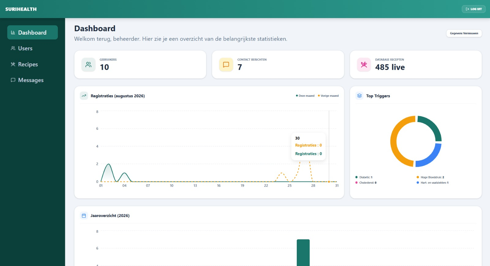

Het beheerdersdashboard (`/admin/dashboard`) fungeert als het centrale data- en analysecentrum voor de administrator van SuriHealth. Zodra deze route wordt geïnitialiseerd, treedt een beveiligde server-side loader in werking. Deze loader dwingt via Better Auth een harde rol-controle af (`role === 'admin'`) en haalt vervolgens via de server-function `adminGetPlatformStats` de realtime platformgegevens rechtstreeks op uit PostgreSQL.

---

## Realtime Platform Statistieken

Bovenaan het dashboard worden de belangrijkste numerieke parameters van het platform overzichtelijk weergegeven in drie afzonderlijke prestatiekaarten:

- **Gebruikers**: Toont het totale aantal unieke, geregistreerde consumentenaccounts binnen de `users` tabel. Dit getal helpt bij het monitoren van de platformgroei.
- **Contact Berichten**: Geeft het actuele aantal onbeantwoorde support tickets en feedbackformulieren weer uit de `contacts` tabel.
- **Database Recepten**: Toont de omvang van de master-catalogus (standaard 485 gerechten) uit de `recipes` tabel, inclusief de door de beheerder handmatig toegevoegde Surinaamse variaties.

---

## Analytische Datagrafieken & Rapporten

Het dashboard maakt gebruik van responsive visualisatie-grids om trends en risicofactoren binnen de populatie direct inzichtelijk te maken voor het beheerteam:

### 1. Maandelijkse Registratie-overzichten
- **Functie**: Een dynamische lijngrafiek die het aantal nieuwe gebruikersregistraties gedurende de actieve maand in kaart brengt.
- **Vergelijking**: De interface projecteert automatisch een vergelijkingsvector met de data van de voorgaande maand. Dit stelt de beheerder in staat om de effectiviteit van eventuele gezondheidscampagnes direct te evalueren.

### 2. Gezondheidsrisico's & Top Triggers
- **Functie**: Deze sectie aggregeert live alle medische condities uit de `profiles` kolom van PostgreSQL.
- **Analytische Waarde**: Het systeem berekent en rangschikt welke chronische aandoeningen het meest voorkomen onder de actieve gebruikersgroep (zoals *Diabetes*, *Hoge Bloeddruk*, *Cholesterol* of *Hart- en vaatziekten*). Dit geeft de beheerder cruciale demografische inzichten om gerichte Surinaamse receptenreeksen aan de database toe te voegen.

### 3. Geconsolideerd Jaaroverzicht
- Onderaan het dashboard bevindt zich een brede staafgrafiek die de platform-activiteit over de afgelopen 12 maanden cumulatief weergeeft, wat essentieel is voor periodieke managementrapportages.

---

## Interface van de Beheerdersomgeving

Het dashboard is ontworpen rondom een strakke data-grid indeling en maakt gebruik van subtiele visuele scheidingslijnen om de scannbaarheid van grote hoeveelheden data te waarborgen.

*Figuur 14. Het centrale administratieve dashboard van het SuriHealth platform.*

---

:::note
Alle getoonde statistieken op deze pagina zijn strikt anoniem. Het systeem aggregeert uitsluitend de totale aantallen en metadata uit de database om trends te tonen, waardoor de individuele medische privacy van uw gebruikers te allen tijde gewaarborgd blijft conform de AVG-richtlijnen.
:::

:::caution
Mocht de PostgreSQL database tijdelijk onbereikbaar zijn (bijvoorbeeld door onderhoud op poort 5432), dan tonen de KPI-kaarten automatisch een fallback-waarde van `0` of een laad-indicator (`Loader2`). De beheerder kan in dat geval geen data muteren totdat de SQL-verbinding succesvol is hersteld.
:::