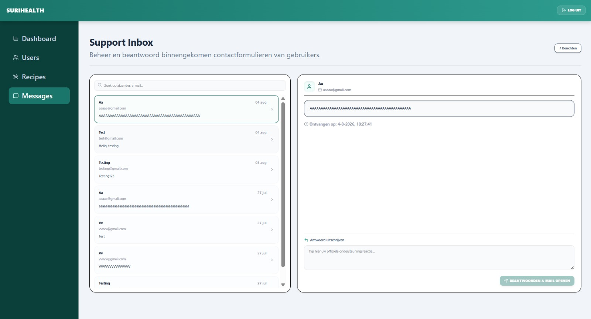

De administratieve berichtenpagina (`/admin/contact`) fungeert als het centrale communicatieportaal voor de helpdesk van SuriHealth. De pagina laadt binnengekomen gebruikersvragen realtime in via de server-side route-loader, aangedreven door de server-function `adminGetContactMessages` en Drizzle ORM-koppelingen met de PostgreSQL-tabel `contacts`.

---

## De Split-Pane Inbox Architectuur

De interface is opgebouwd rondom een efficiënt split-pane ontwerp, waardoor de beheerder tickets kan inzien en afhandelen zonder constante paginawisselingen:

### 1. Het Ticket-Overzichtspanel (Linkerzijde)
Dit paneel toont een verticale, chronologisch gesorteerde lijst van alle binnengekomen ondersteuningsaanvragen. Elk lijst-item geeft direct de belangrijkste kerngegevens weer:
- De naam van de afzender.
- Het geregistreerde e-mailadres (unieke gebruikersidentificatie).
- Een ingekorte, twee-regelige preview van het supportbericht (`line-clamp-2`).
- De datum van binnenkomst, geformatteerd naar de Surinaamse tijdnotatie (`nl-SR`).

### 2. Realtime Zoek- & Filterlaag
Boven de ticketlijst bevindt zich een actieve zoekbalk gekoppeld aan een directe tekst-matcher.
- **Werking**: Zodra u begint te typen, filtert de frontend de lijst direct op basis van de naam, het e-mailadres of specifieke trefwoorden in de berichtinhoud. Dit stelt u in staat om specifieke supportvragen binnen een fractie van een seconde te isoleren.

### 3. Het Detail- & Actiecompartiment (Rechterzijde)
Wanneer u aan de linkerzijde een ticket selecteert, laadt het rechterpaneel direct de volledige inhoud in via een geanimeerde transitie (`animate-in fade-in`):
- Toont de volledige, onverkorte berichttekst in een overzichtelijk, scrollbaar tekstvak.
- Toont de exacte ontvangsttijdstempel van de server.
- Activeert het asynchrone antwoordformulier onderaan het scherm.

---

## Interface van het Support Bureau

Het berichtenbeheer maakt gebruik van een minimalistische lay-out met een duidelijke verdeling tussen de ticketlijst en het actieve leesvenster.

*Figuur 15. De split-pane helpdesk-interface van de SuriHealth beheeromgeving.*

---

## De Double-Action Antwoord Workflow

Wanneer u een reactie formuleert en klikt op de knop **Beantwoorden & mail openen**, activeert het platform een gecoördineerde client-server workflow om data-integriteit te garanderen:

1. **Server-Side Validatie**: De frontend roept asynchroon de server-function `adminReplyToMessage` aan en stuurt het ticket-ID en uw reactie mee. De server valideert de aanvraag type-safe via een Zod-schema en verifieert of het ticket daadwerkelijk bestaat in PostgreSQL.
2. **SQL Crash-Preventie**: Omdat de `contacts` tabel in de database geen antwoord-kolom bevat, wordt de actie puur veilig gelogd op de server-console. Dit voorkomt database-type-mismatches en SQL-crashes.
3. **Native E-mail Distributie**: Zodra de server de actie goedkeurt, activeert de frontend direct een native window-redirect (`window.location.href = mailto:...`). Uw e-mailprogramma (zoals Outlook of Mail) opent onmiddellijk met het e-mailadres van de gebruiker, het support-onderwerp en uw getypte antwoordtekst volledig vooringevuld en klaar voor verzending.

:::note
Mocht de berichtenlijst volledig leeg zijn, dan toont het rechterpaneel een gecentreerd rustscherm met een subtiel enveloppe-icoon en de tekst *"Geen bericht geselecteerd"*. Het platform verbergt actieve invoervelden automatisch totdat er een geldig ticket wordt aangeklikt.
:::

:::caution
Het antwoordveld vereist een minimale invoer van 4 tekens om lege of foutieve verzendingen te voorkomen. Tijdens de server-validatie tonen de knoppen een actieve laadindicator (`Loader2 animate-spin`) om te voorkomen dat er dubbele verzoeken naar het mailprogramma worden gestuurd.
:::