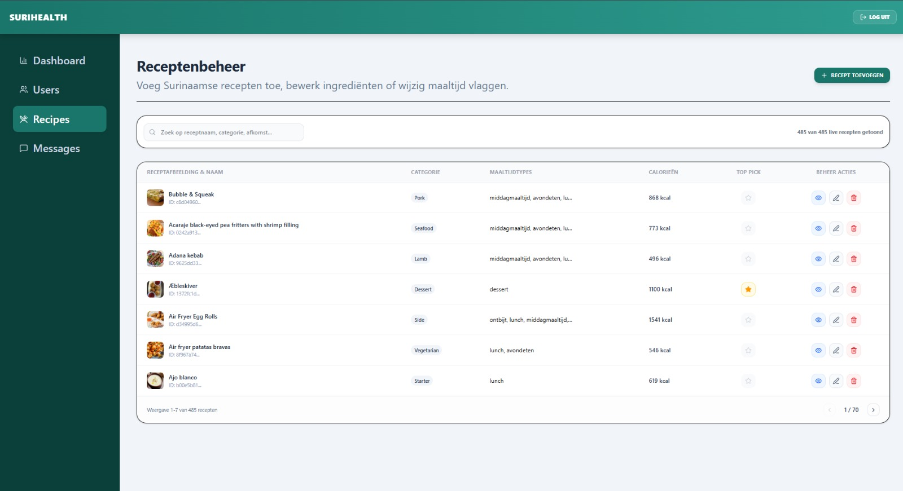

De administratieve receptenpagina (`/admin/recipes`) fungeert als het centrale beheerstation voor de master-catalogus van SuriHealth. Via dit controlepaneel dwingt de server-side route-loader via Better Auth een harde rol-controle af (`role === 'admin'`) en haalt vervolgens via de server-function `adminGetPlatformStats` alle beschikbare database-records realtime op uit de PostgreSQL-tabel `recipes`.

---

## Het Administratieve Gegevensraster

De recepten worden gepresenteerd in een gestructureerd, pagineerbaar gegevensraster. Per rij map het systeem de actuele eigenschappen uit de database:
- **Receptafbeelding & Identificatie**: Toont de gecachte omslagfoto met daarnaast de officiële titel en de unieke, cryptografische database-sleutel (`ID`) van het record.
- **Database Categorie**: Geeft de hoofdcategorie aan (zoals *Kip*, *Rundvlees*, *Vis*, *Garnalen*, *Vegetarisch*, of *Dessert*).
- **Maaltijd-Etiketten (`mealTypes`)**: Toont de specifieke gebruiksmomenten (bijv. *Ontbijt*, *Lunch*, *Avondeten*) waarin het recept getoond mag worden op het consumenten-dashboard.
- **Energie-Index**: Toont de exacte energiewaarde in kilocalorieën (kcal). Mocht deze waarde in PostgreSQL ontbreken, dan berekent de server deze runtime via de `calorieCalculator.ts` motor.

---

## De Volledige CRUD-Levenscyclus

Aan de rechterzijde van elk recept heeft de beheerder direct toegang tot asynchrone mutatie-poorten die via TanStack Start Server Functions rechtstreeks communiceren met PostgreSQL:

### 1. Inzien
- **Functie**: Klik op de blauwe weergaveknop (oog-icoon). Dit opent direct een interactieve overlay (`modal subcomponent`) waarin de volledige ingrediëntenlijst en bereidingsinstructies overzichtelijk en gestructureerd kunnen worden gecontroleerd.

### 2. Toevoegen & Bewerken
- **Functie**: Klik op **Recept Toevoegen** of op de bewerkknop (potlood-icoon) van een rij. Dit activeert een uitgebreid invulformulier.
- **Live Calorie-Monitoring**: Het formulier bevat een actieve `useEffect` listener gekoppeld aan de invoervelden van de ingrediënten. Zodra u ingrediënten typt, scant de ingebouwde calorieënmotor de tekst runtime. De calculator berekent direct de verwachte energiewaarde op uw scherm, zodat u direct accurate en on-inflated records opslaat in PostgreSQL via `adminCreateRecipe` of `adminUpdateRecipe`.

### 3. Verwijderen
- **Functie**: Klik op de rode verwijderknop (prullenbak-icoon). Na een handmatige browser-bevestiging activeert de frontend de server-function `adminDeleteRecipe`. Het record wordt permanent en type-safe gewist uit PostgreSQL, en de rij verdwijnt direct asynchroon uit de tabel zonder laadvertragingen.

---

## Interface van het Receptenbeheer

Het controlepaneel maakt gebruik van compacte tabellen en afgeronde kaart-componenten om de scannbaarheid van grote hoeveelheden data te waarborgen.

*Figuur 16. Het administratieve recepten- en CRUD-dashboard van het SuriHealth platform.*

---

## Caching Vector voor Top Picks & Paginering

Het platform is aan de onder- en bovenzijde voorzien van geautomatiseerde gegevensregelaars om server-overbelasting te voorkomen:

- **Top Pick Schakelaar**: Klik op de ster-knop in een tabelrij. Dit triggert direct op de achtergrond de server-function `adminToggleTopPick`. De database-status wordt realtime omgeschakeld (`isTopPick: !currentStatus`). Het gerecht verschijnt (of verdwijnt) onmiddellijk in de prominente carrousel op het hoofd-dashboard van alle consumenten.
- **Compacte Paginering-beheer**: Om de laadtijden op mobiele netwerken te minimaliseren, splitst het dashboard de 485 records op in subpagina's van **exact 7 recepten per pagina**. De navigatiebalk toont live op welke pagina u zich bevindt en hoeveel recepten er binnen uw actieve zoekopdracht vallen.

:::note
Wanneer u ingrediënten invoert in het formulier, scheidt u de afzonderlijke elementen altijd met een komma (bijv. *Kip, Knoflook, Ui*). De server-function splitst deze tekstvlakken op basis van de komma's automatisch op in een schone string-array voordat de data naar de Drizzle-adapter wordt gepusht.
:::

:::caution
Het permanent verwijderen van een recept wist ook direct alle gekoppelde kookhistorie-verwijzingen (`userHistory`) van uw gebruikers in PostgreSQL. Voer deze actie dus uitsluitend uit als een gerecht definitief uit het SuriHealth platform gehaald moet worden.
:::