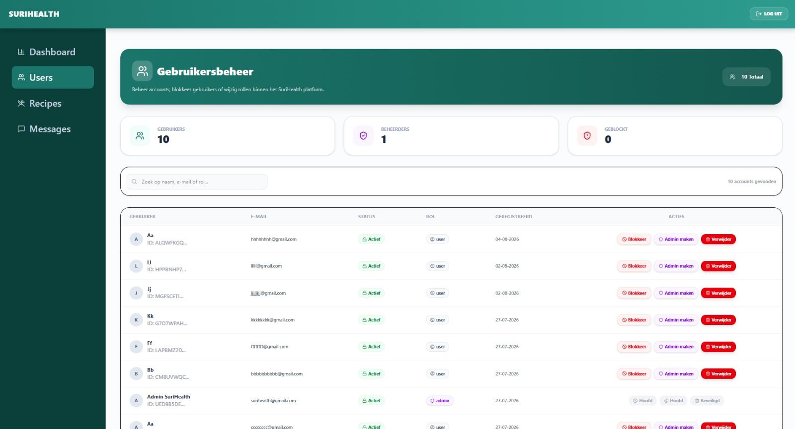

Het administratieve gebruikersportaal (`/admin/users`) biedt het beheerteam volledige controle over de toegang, autorisatieniveaus en integriteit van de geregistreerde accounts binnen het SuriHealth platform. De pagina dwingt aan de server-zijde via Better Auth een strenge poortwachterscontrole af om te garanderen dat privacygevoelige medische gegevens uitsluitend in te zien zijn door de geautoriseerde administrator [INDEX].

---

## Realtime Accountstatistieken

Bovenaan het scherm aggregeert de server-function live alle records uit de `users` tabel om de actuele configuratiestatus van de populatie in drie overzichtelijke metertrackers weer te geven:

- **Gebruikers**: Het totale aantal unieke consumentenaccounts dat in de database is geregistreerd.
- **Beheerders**: Het aantal accounts dat is voorzien van de verhoogde administratieve rol (`role === 'admin'`).
- **Geblokkeerd**: Het aantal accounts waarbij de toegangsvlag handmatig is omgezet naar een actieve blokkadestatus (`blocked: true`).

---

## De Gebruikersmatrix & Zoekfilters

Alle accounts worden gepresenteerd in een overzichtelijk, geordend gegevensraster. Boven de tabel bevindt zich een universele zoekbalk gekoppeld aan een directe tekst-matcher.
- **Zoekbereik**: De beheerder kan realtime zoeken op de geregistreerde naam, het e-mailadres of direct filteren op specifieke rollen.
- **Rij-anatomie**: Per rij map het raster de kerneigenschappen van het account: de gebruikersnaam, het e-mailadres (unieke ID), de actuele status (bijv. *Actief* of *Geblokkeerd*), de toegekende rol, en de exacte registratiedatum geformatteerd naar de Surinaamse tijdnotatie (`nl-SR`).

---

## Interface van het Gebruikersbeheer

Het controlepaneel maakt gebruik van duidelijke status-badges die automatisch mee-kleuren met de actuele status van een account om foutieve mutaties te voorkomen.

*Figuur 17. Het administratieve gebruikers- en accountbeheer van het SuriHealth platform.*

---

## Administratieve Autorisatieacties
Aan de rechterzijde van elk gebruikersaccount bevinden zich asynchrone mutatie-poorten die via TanStack Start Server Functions rechtstreeks communiceren met PostgreSQL:

### 1. Blokkeren en Deactiveren
- **Functie**: Klik op de blokkeerknop om de toegang van een gebruiker per direct in te trekken. 
- **Server Interceptor**: Dit activeert de backend-functie die de databasevlag omzet naar `true`. Zodra dit gebeurt, treedt de harde interceptor in de authenticatie-route (`/get-session`) in werking. De actieve sessie van de gebruiker wordt direct ongeldig verklaard en de server weigert bij elke volgende netwerk-request de toegang met een `403 Forbidden` statuscode [INDEX].

### 2. Promoveren tot Beheerder
- **Functie**: Hiermee kent u een reguliere gebruiker volledige administratieve rechten toe binnen het platform. De Drizzle ORM-laag overschrijft de rol-kolom in PostgreSQL, waardoor de nieuwe beheerder bij zijn volgende inlogsessie direct toegang krijgt tot de recepten-CRUD en de support-inbox.

### 3. Account Permanent Verwijderen
- **Functie**: Na een handmatige browser-bevestiging activeert de frontend de verwijder-server-function. Het gebruikersrecord wordt permanent gewist uit PostgreSQL.

---

## Beveiliging van de Hoofdbeheerder

:::note
Het platform bevat een harde cryptografische beveiliging om te voorkomen dat het administratieve systeem zichzelf per ongeluk buitensluit. Voor accounts die zijn gemarkeerd als hoofdbeheerder (zoals het standaard seeder-account `surihealth@gmail.com`) zijn de knoppen voor blokkeren, degraderen of verwijderen in de interface volledig uitgeschakeld en voorzien van het label **Beveiligd** of **Hoofd**.
:::

:::caution
Het permanent verwijderen van een gebruikersaccount heeft een cascade-effect in de database. Alle gekoppelde medische condities (`profiles`), favoriete recepten (`favorites`), kookhistorie-logs (`userHistory`) en actieve boodschappenlijsten worden via de PostgreSQL-relaties direct permanent mee-gewist om data-vervuiling (orphan records) te voorkomen.
:::