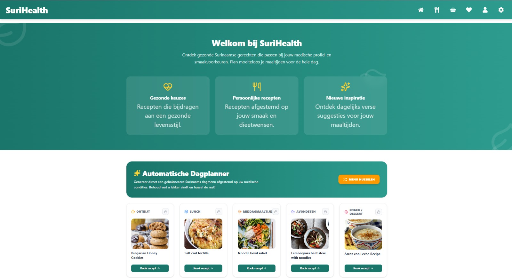

Na het registreren of inloggen wordt de gebruiker automatisch doorgestuurd naar het dashboard.

Op het dashboard kan de gebruiker een automatisch maaltijdplan instellen.

## Automatisch maaltijdplan instellen

Met de optie **Automatisch** kan de gebruiker automatisch een maaltijdplan laten samenstellen.

Volg de onderstaande stappen:

1. Open het **Dashboard**.
2. Klik op **Automatisch**.
3. Stel de gewenste voorkeuren voor het maaltijdplan in.
4. Bevestig de instellingen.
5. SuriHealth genereert automatisch een ontbijt, lunch en avondmaaltijd.
6. Klik op **Recept** om de details van een maaltijd te bekijken.
7. Vernieuw de pagina om nieuwe maaltijdsuggesties te krijgen.

*Figuur 4. Dashboard page van SuriHealth.*
