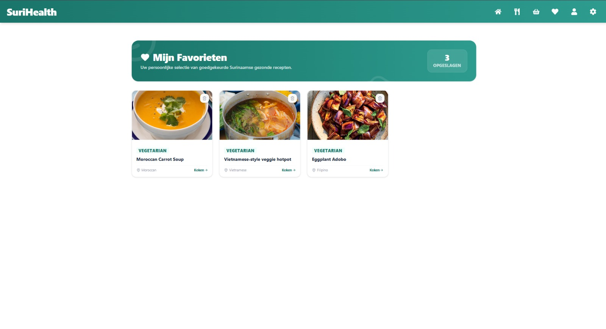

De favorietenpagina (`/dashboard/favorites`) biedt gebruikers een gecentraliseerd, persoonlijk kookboek. In tegenstelling tot de algemene receptencatalogus, laadt de server-side route-loader hier via een database-join uitsluitend de recepten in die door de ingelogde gebruiker expliciet zijn gemarkeerd met een kwaliteitsvlag (hart-icoon).

---

## Werking van de Favorieten-Matrix

De pagina communiceert realtime met de PostgreSQL-tabellen via het TanStack Start framework om een sluitende en betrouwbare gebruikerservaring te garanderen:

### 1. Live Database Synchronisatie
- Zodra de pagina opent, controleert de backend-loader via de Better Auth sessie-cookie de unieke identificatie (`userId`) van de gebruiker. 
- Drizzle ORM trekt vervolgens een gefilterde lijst uit de database. Dit garandeert dat uw opgeslagen gerechten direct en accuraat in beeld verschijnen, zonder vertragingen of dataverlies.

### 2. Dynamische Grid Matrix
De opgeslagen maaltijden worden gepresenteerd in een overzichtelijke grid-indeling die automatisch meespat met uw schermformaat. Elke receptenkaart toont de herkenbare SuriHealth-indicatoren:
- De database hoofdcategorie (zoals *Kip*, *Vis*, of *Vegetarisch*).
- De berekende energetische waarde in kilocalorieën (kcal) via de `calorieCalculator.ts` motor.
- Een directe navigatiekoppeling om met één klik de volledige bereidingswijze en ingrediëntenlijst te openen (`/dashboard/recipes/view/$recipeId`).

---

## Beheer van Opgeslagen Gerechten

Het platform is zo ontworpen dat u uw kookboek realtime kunt opschonen, rechtstreeks vanaf de overzichtskaarten:

- **Asynchroon Verwijderen**: Als u een gerecht wilt verwijderen, klikt u simpelweg op de actieve favorieten-knop (het rode hart-icoon) op de receptenkaart. 
- **State-Update**: Dit triggert direct op de achtergrond de server-function `toggleFavorite`. De database-koppeling in PostgreSQL wordt type-safe verbroken, en de frontend verwijdert de receptenkaart onmiddellijk met een vloeiende overgang uit het raster, zonder dat de volledige webpagina opnieuw hoeft te verversen.

---

## Interface van de Favorietenpagina

Het favorietenoverzicht maakt gebruik van gecachte data-states om te zorgen dat uw persoonlijke selectie ook bij een trage internetverbinding direct accuraat wordt opgebouwd.

*Figuur 9. Het persoonlijke favorietenoverzicht van het SuriHealth platform.*

:::note
Mocht uw favorietenlijst volledig leeg zijn, dan toont het platform een gecentreerd, leeg infopaneel met een subtiel vector-icoon en de tekst *"Nog geen favoriete recepten opgeslagen"*. U kunt op elk gewenst moment via de navigatiebalk terugkeren naar de receptencatalogus om nieuwe gerechten aan uw lijst toe te voegen.
:::

:::tip
Alle recepten binnen uw favorietenoverzicht blijven onderhevig aan de actieve medische filters op uw dashboard. Als u uw gezondheidsprofiel aanpast (bijvoorbeeld naar een strenger zoutarm dieet), worden gerechten met een te hoog natriumgehalte ook in dit overzicht automatisch tijdelijk afgeschermd voor uw eigen veiligheid.
:::