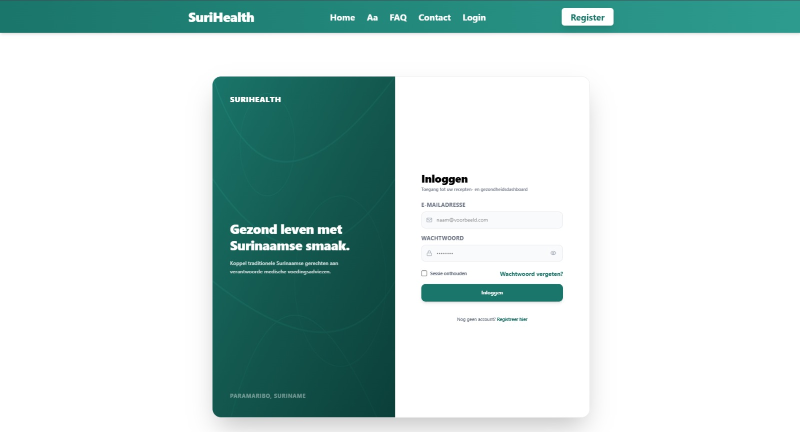

Het inlogsysteem van SuriHealth beschermt uw opgeslagen medische condities, allergieën en dagplanners tegen onbevoegde toegang. Het aanmeldproces verloopt via een cryptografisch beveiligde communicatielaag die uw gebruikerssessie direct synchroniseert met de database.

---

## Stappen om In te Loggen

Volg de onderstaande stappen op de loginpagina om veilig toegang te krijgen tot uw persoonlijke omgeving:

### 1. Navigeer naar de Loginpagina
Klik in de navigatiebalk rechtsboven op de knop **Inloggen** of open direct de URL `http://localhost:3000/login`.

### 2. Vul uw Inloggegevens In
Voer uw geregistreerde gegevens in de invoervelden in:
- **E-mailadres**: Het e-mailadres waarmee u uw account heeft aangemaakt.
- **Wachtwoord**: Uw unieke, persoonlijke wachtwoord.

### 3. Aanmelden en Sessie Synchronisatie
Klik op de knop **Login**. Op de achtergrond wordt de aanvraag direct onderschept door de `/signin-email` handler van onze `$.ts` API-route:
- **Better Auth Validatie**: Het systeem controleert of de combinatie van e-mail en wachtwoord correct matcht met het opgeslagen record in de PostgreSQL-tabel `users`.
- **Profiel Koppeling**: Bij een succesvolle validatie haalt de server-side handler via `db.query.profiles.findFirst` direct uw meest actuele biometrische en medische vlaggen op. Deze worden aan uw actieve sessie gekoppeld om frontend resets te voorkomen.
- **Dashboard Toegang**: U wordt direct en type-safe doorgestuurd naar uw persoonlijke dashboard (`/dashboard/`).

:::note
Vink de optie **Onthoud mijn gegevens** aan als u wilt dat uw sessie-token lokaal in de browser gecached blijft. Hierdoor hoeft u bij een volgend bezoek niet opnieuw uw wachtwoord in te voeren. Gebruik deze optie uitsluitend op betrouwbare, persoonlijke apparaten.
:::

---

## Interface van de Loginpagina

Het inlogvenster is strak en minimalistisch ontworpen om een snelle en veilige toegang te waarborgen.

*Figuur 3. Inlog-interface van het SuriHealth platform.*

---

## Ingebouwde Veiligheidsinterceptors

SuriHealth dwingt strenge beveiligingsregels af op server-niveau om de integriteit van de database te bewaken:

### 1. Beheerder (Admin) Herkenning
Wanneer er wordt ingelogd met de gereserveerde beheerdersgegevens (`surihealth@gmail.com`), herkent de server-handler dit onmiddellijk. De Drizzle ORM-laag activeert de rol `'admin'`, waardoor u direct toegang krijgt tot de statistieken, de berichteninbox en de recepten-CRUD console.

### 2. Harde Blokkeer Interceptor
Mocht een account door een beheerder zijn gemarkeerd als geblokkeerd (`blocked: true`), dan treedt de harde interceptor in de backend direct in werking. De inlogpoging wordt onmiddellijk afgebroken en de server stuurt een `403 Forbidden` statuscode terug met de melding: 
*"Toegang geweigerd. Dit account is permanent geblokkeerd door de beheerder."*

:::caution
Zorg ervoor dat u uw wachtwoord geheim houdt. Omdat het platform persoonsgegevens bevat omtrent medische condities (zoals diabetes en hypertensie), is een sterk wachtwoord uw eerste en belangrijkste verdedigingslinie.
:::

Uw inlogsysteem is hiermee volledig full-stack gedocumenteerd. Ga direct door naar de handleiding [Eerste Keer Opstarten](/guides/aan-de-slag/) om te leren hoe u uw eerste stappen binnen het dashboard zet.