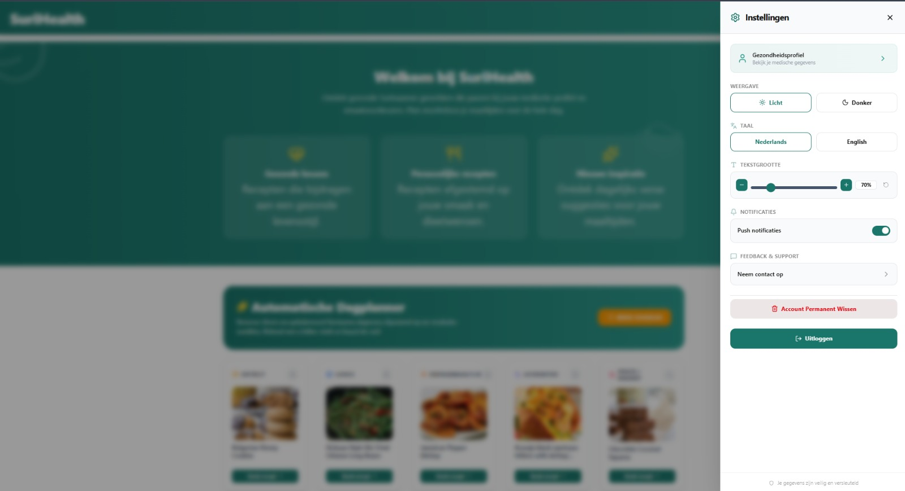

Via de instellingenpagina kun je de applicatie aanpassen aan jouw voorkeuren.

Beschikbare instellingen zijn onder andere:

- Thema aanpassen
- Taal wijzigen
- Account beheren

Wijzig de gewenste instellingen en sla de wijzigingen op.

*Figuur 11. Instellingen page van SuriHealth.*
