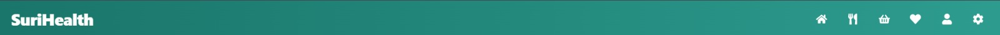

De hoofdnavigatiebalk van SuriHealth bevindt zich permanent aan de bovenzijde van de consumentenomgeving. Dit interface-element fungeert als de primaire routeringslaag van het platform. De navigatiebalk past zich dynamisch aan op de actieve inlogsessie van Better Auth en de schermgrootte van uw apparaat.

---

## Beschikbare Navigatie-Elementen

Wanneer u succesvol bent ingelogd op uw account, biedt de navigatiebalk directe, type-safe toegang tot de volgende kernonderdelen van de applicatie:

### 1. Logo & Home-Koppeling
- Klik op het **SuriHealth Logo** aan de linkerzijde om vanaf elke subpagina direct terug te keren naar uw centrale gezondheidsdashboard (`/dashboard/`).

### 2. Recepten Catalogus
- **Ongefilterd Master-Overzicht**: Stuurt u door naar de route `/dashboard/recipes/`. In tegenstelling tot het dashboard toont deze pagina de volledige database van alle 485 gerechten ter inspiratie, zonder uw actieve medische profielfilters direct toe te passen.

### 3. Favorieten
- Geeft toegang tot uw persoonlijk opgeslagen recepten. Dit paneel synchroniseert live met de database via de server-functie `toggleFavorite`, zodat u snel uw meest gewaardeerde gezonde maaltijden kunt terugvinden.

### 4. Digitale Boodschappenlijst
- Schakelt door naar uw actieve ingrediënten-overzicht. Hier worden alle los toegevoegde ingrediënten vanuit de recepten-detailpagina's centraal verzameld, zodat u direct een overzichtelijk boodschappenbriefje bij de hand heeft op uw smartphone.

### 5. Gebruikersprofiel & Instellingen
- **Profiel**: Geeft toegang tot uw biometrische intake-tabbladen (`/dashboard/profile/`) om uw gewicht, leeftijd of medische vlaggen (zoals diabetes en hypertensie) realtime bij te werken.
- **Uitloggen**: Beëindigt uw Better Auth sessie op een veilige manier, wist de lokale browser-caches en stuurt u terug naar de publieke landingspagina.

---

## Interface van de Navigatiebalk

De balk maakt gebruik van een minimalistische, semi-transparante achtergrondlaag (`backdrop-blur`) zodat deze elegant over de meescrollende recepten-rijen heen zweeft.

*Figuur 5. Hoofdnavigatiebalk van het SuriHealth platform.*

---

## Responsive Gedrag op Mobiele Apparaten

:::note
Wanneer u de applicatie opent op een smartphone of smalle tablet, comprimeert de navigatiebalk de menu-links automatisch tot een compact **Hamburger-menu** (drie horizontale streepjes) aan de rechterzijde. Klik op dit icoon om het navigatiepaneel verticaal over uw scherm uit te klappen.
:::

:::tip
Mocht een pagina niet direct verspringen na het aanklikken van een link in de balk, controleer dan of er op de achtergrond geen invoervelden (zoals de medische vragenlijst) onopgeslagen zijn achtergelaten. Sla wijzigingen altijd eerst op via de centrale bewaarknoppen.
:::
