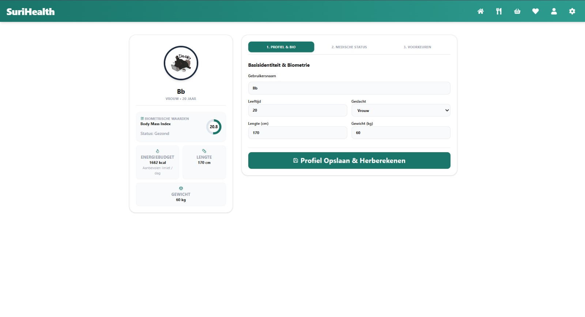

De profielpagina (`/dashboard/profile`) fungeert als het klinische controlecentrum voor de consument. De interface is rechtstreeks gekoppeld aan uw PostgreSQL-profielrij. Wijzigingen die u hier doorvoert, dwingen de server direct om uw dagelijkse caloriebudgetten te herberekenen en uw actieve medische filters (`recipeFilters.ts`) realtime te herstructureren.

---

## Interactieve Gezondheidsindicatoren (Linkerzijde)

Het profielscherm toont aan de linkerzijde een geavanceerd visueel dashboard dat uw actuele fysiologische status berekent en monitort op basis van uw ingevoerde biometrie:

### 1. Body Mass Index (BMI) Voortgangsmeter
- Het systeem voert live een automatische gewichts- en lengteberekening uit. De meter toont direct uw exacte BMI-waarde en categoriseert uw status direct (bijv. *Gezond gewicht*, *Ondergewicht*, of *Overgewicht*) via een dynamische, gekleurde cirkel-grafiek.

### 2. Dieet Veiligheidsscore
- Deze index berekent realtime de strengheid van uw actieve filters. Elke medische conditie of allergie die u inschakelt, voegt een specifieke risicovariabele toe. Dit laat u in één oogopslag zien hoe intensief het platform receptingrediënten zuivert om uw gezondheid te beschermen.

### 3. Dagelijkse Energiebehoefte (BMR-Meting)
- Aangedreven door de fysiologische **Harris-Benedict formule**, herrekent de backend direct uw basale metabolisme op basis van uw leeftijd, gewicht, lengte en geslacht. De balk toont exact hoeveel kilocalorieën (kcal) u maximaal per dag mag consumeren binnen uw maaltijdplanners.

---

## De Drie Intake Tabbladen (Rechterzijde)

De invoervelden zijn onderverdeeld in drie overzichtelijke, functionele categorieën om een snelle en foutloze navigatie te garanderen:

- **1. Identiteit**: Beheer uw weergavenaam, selecteer uw biologische geslacht en pas uw leeftijd, lengte of gewicht aan. Dit tabblad bevat tevens een handmatige foto-uploadoptie.
- **2. Medische Restricties**: Activeer of deactiveer chronische aandoeningen (*Diabetes*, *Hoge Bloeddruk*, *Cholesterol*, *Hart- en vaatziekten*), koppel specifieke dieetstijlen (*Vegetarisch*, *Veganistisch*, *Gluten-vrij*, *Lactose-vrij*, *Zoutarm*), en beheer uw voedselallergieën.
- **3. Smaak Filters**: Geef uw culinaire voorkeuren en afkeuren op voor Surinaamse basiselementen (zoals kip, bakkeljauw, kouseband of sopropo) om uw dashboardcarrousel verder te personaliseren.

---

## Wijzigingen Verwerken en Database-Opslag

Volg de onderstaande stappen om uw gezondheidsprofiel succesvol bij te werken:

1. Navigeer naar het gewenste tabblad en pas uw gegevens of medische vlaggen aan.
2. Klik onderaan de pagina op de knop **Profiel Opslaan & Herberekenen**.
3. Op de achtergrond voert het framework de volgende stappen uit:
   - De server-function `submitProfileSetup` valideert uw invoer type-safe via Zod-schema's.
   - Drizzle ORM voert een `onConflictDoUpdate` uit in PostgreSQL, waardoor uw record direct wordt overschreven.
   - De browser-cache wordt direct geleegd, de pagina ververst geautomatiseerd en uw dashboard is per direct aangepast aan uw nieuwe gezondheidssituatie.

---

## Interface van de Profielpagina

Het profielscherm maakt gebruik van een tweekoloms indeling die automatisch responsive mee-schaalt op mobiele apparaten.

*Figuur 10. Het profiel- en biometrisch controlescherm van het SuriHealth platform.*

:::note
Wanneer u uw profielfoto uploadt, controleert het systeem de bestandsgrootte. Bestanden groter dan 2MB worden om prestatieredenen op het netwerk automatisch geweigerd om trage laadtijden op mobiele apparaten te voorkomen.
:::

:::caution
Elke medische aandoening die u hier in- of uitschakelt, heeft direct invloed op uw receptenoverzicht. Schakelt u bijvoorbeeld *Hoge Bloeddruk* uit, dan laat de database direct weer traditionele gerechten met zoutvlees of bakkeljauw toe op uw dashboard. Wijzig deze vlaggen dus alleen op advies van uw zorgverlener.
:::
