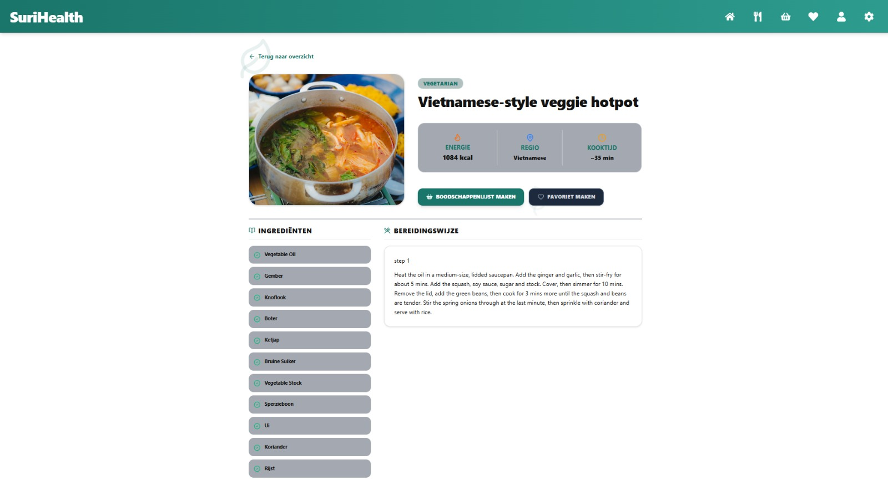

1. Klik op een recept.
2. Bekijk de ingrediënten en bereidingswijze.
3. Klik op het hartje om het recept als favoriet op te slaan.
4. Klik op **Alle ingrediënten toevoegen** om de ingrediënten toe te voegen aan de boodschappenlijst.

*Figuur 7. Recept details van SuriHealth.*