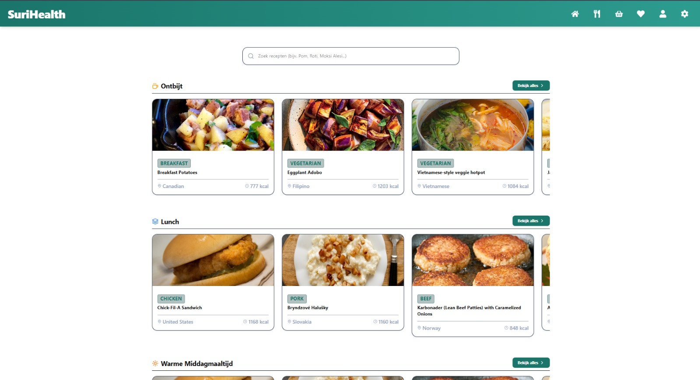

Het receptenoverzicht van SuriHealth fungeert als de complete, algemene database van het platform. In tegenstelling tot het dashboard — dat recepten direct medisch blokkeert — toont deze master-catalogus alle beschikbare Surinaamse en internationale gerechten ter inspiratie. Dit stelt gebruikers in staat om vrij door het kookboek te bladeren en maaltijden te ontdekken.

---

## Onderdelen van de Master-Catalogus

De algemene receptenpagina (`/dashboard/recipes`) is zo ingericht dat u razendsnel door de database van 485 unieke gerechten kunt navigeren via de volgende ingebouwde componenten:

### 1. Realtime Universele Zoekbalk
Bovenaan de pagina bevindt zich een slimme zoekbalk gekoppeld aan een directe tekst-matcher. 
- **Werking**: Zodra u begint te typen (bijv. *Pom*, *Roti*, of *Moksi Alesi*), filtert de interface het overzicht onmiddellijk op basis van receptnaam, Nederlandse vertaling of hoofdcategorie. 
- **Failsafe**: De zoekbalk reageert live op elke toetsaanslag en toont direct het aantal gevonden resultaten, waardoor u nooit handmatig door pagina's hoeft te bladeren.

### 2. Ongefilterde Categorie-Rijen
Als de zoekbalk leeg is, ordent het platform alle gerechten in handige, horizontaal scrollbare rijen gesorteerd per maaltijdtype: **Ontbijt, Lunch, Warme Middagmaaltijd, Avondeten en Snacks & Desserts**.

---

## Interface van de Receptenpagina

De catalogus maakt gebruik van visueel aantrekkelijke kaarten waarin de belangrijkste kenmerken van de maaltijd in één oogopslag scannbaar zijn.

*Figuur 6. De algemene receptencatalogus van het SuriHealth platform.*

---

## Anatomie van een Receptenkaart

Elk gerecht in het overzicht wordt gepresenteerd op een compacte kaart die automatisch mee-kleurt met uw actieve thema (Light of Dark Mode). De kaart bevat de volgende herkenbare indicatoren:

- **Categorie-badge**: Toont direct de hoofdcategorie van het gerecht (zoals Kip, Vis, Rundvlees of Vegetarisch).
- **Gerechtnaam**: De officiële Surinaamse of internationale benaming van de maaltijd.
- **Regio-indicator**: Een vector-icoon dat het land van herkomst of de Surinaamse stijl aanduidt (bijv. Surinaams, Hindoestaans, Javaans of Creools).
- **Calorieën-indicator**: Een indicator die de berekende energetische waarde in kilocalorieën (kcal) toon, aangedreven door de ingebouwde `calorieCalculator.ts` motor.

:::note
Wanneer u op een receptenkaart klikt, wordt u direct doorverwezen naar de specifieke detailpagina van dat gerecht (`/dashboard/recipes/view/$recipeId`). Hier worden uw persoonlijke medische filters wél direct geactiveerd om te controleren of de ingrediënten veilig zijn voor uw profiel.
:::

:::tip
Gebruik de realtime zoekbalk als u snel wilt controleren of een specifiek Surinaams ingrediënt (zoals *sopropo* of *cassave*) in een gerecht is verwerkt. De tekst-matcher doorzoekt alle titels en omschrijvingen onmiddellijk op de achtergrond.
:::