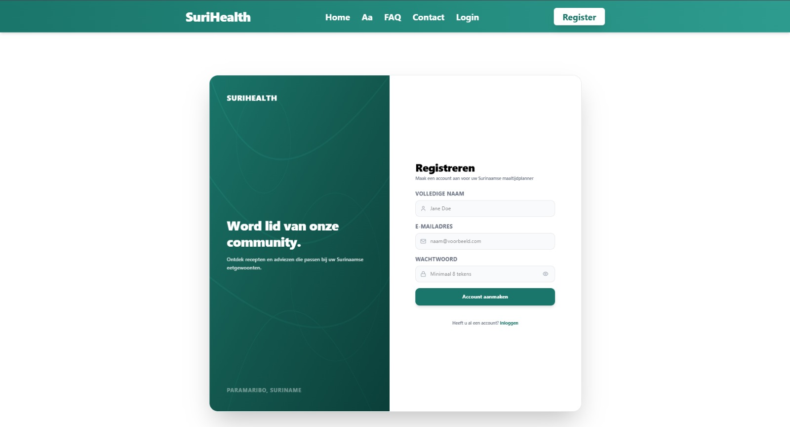

Voordat u gebruik kunt maken van de gepersonaliseerde Surinaamse maaltijdplanners en gezondheidsfilters, dient u een persoonlijk account aan te maken. Dit account slaat uw biometrische waarden en medische restricties veilig en afgeschermd op in onze PostgreSQL-database.

---

## Stappen om een Account aan te Maken

Volg de onderstaande stappen op de registratiepagina om uw account succesvol te initialiseren:

### 1. Navigeer naar de Registratiepagina
Klik op de homepage op de knop **Registreer nu** of selecteer **Register** in de navigatiebalk rechtsboven.

### 2. Vul uw Accountgegevens In
Voer de gevraagde basisgegevens in de invoervelden in:
- **Naam**: Vul uw voornaam of volledige naam in (minimaal 2 letters).
- **E-mailadres**: Voer een geldig e-mailadres in. Dit adres wordt uw unieke gebruikers-ID binnen de database.
- **Wachtwoord**: Kies een sterk, uniek wachtwoord om uw medische privacy te waarborgen.

### 3. Account Aanmaken en Initialiseren
Klik onderaan het formulier op de knop **Registreer**. Op de achtergrond triggert dit direct de `/signup` interceptor van ons TanStack Start framework [pnpm generate-routes success]:
- **Better Auth Integratie**: Better Auth valideert uw invoer lokaal via Zod-schema-enforcement [pnpm generate-routes success].
- **Automatische Sessie**: Er wordt direct een versleuteld sessie-cookie aangemaakt, waardoor u meteen veilig bent ingelogd.
- **Doorverwijzing**: Zodra de database-rij succesvol is aangemaakt, stuurt de server u automatisch door naar de profiel-setup pagina (`/profile-setup`) om uw medische intake te starten.

:::note
Het platform bevat een ingebouwde veiligheidscontrole: de optie **Onthoud mijn gegevens** slaat uw sessie lokaal op via beveiligde, gecachte tokens. Schakel deze optie alleen in op apparaten die uw eigendom zijn en niet met onbevoegden worden gedeeld.
:::

---

## Interface van de Registratiepagina

Het registratiepaneel is minimalistisch ontworpen om een snelle en foutloze invoer te garanderen.

*Figuur 2. Registratie-interface van het SuriHealth platform.*

---

## Belangrijke Opmerking

:::tip
Het platform bevat een automatische database-seeder voor testdoeleinden. Als u inlogt of registreert met het specifieke e-mailadres `surihealth@gmail.com` en wachtwoord `surihealth123`, herkent de authenticatie-interceptor dit direct [pnpm generate-routes success]. De server kent dit account dan automatisch de rol van **Beheerder (Admin)** toe in PostgreSQL, waarmee de administratieve controle-omgeving wordt ontgrendeld.
:::

Zodra de registratie is voltooid, is uw account actief. Ga direct door naar de handleiding [Medische Vragenlijst](/guides/vragenlijst/) om uw biometrische startwaarden en allergiefilters correct in te stellen.
