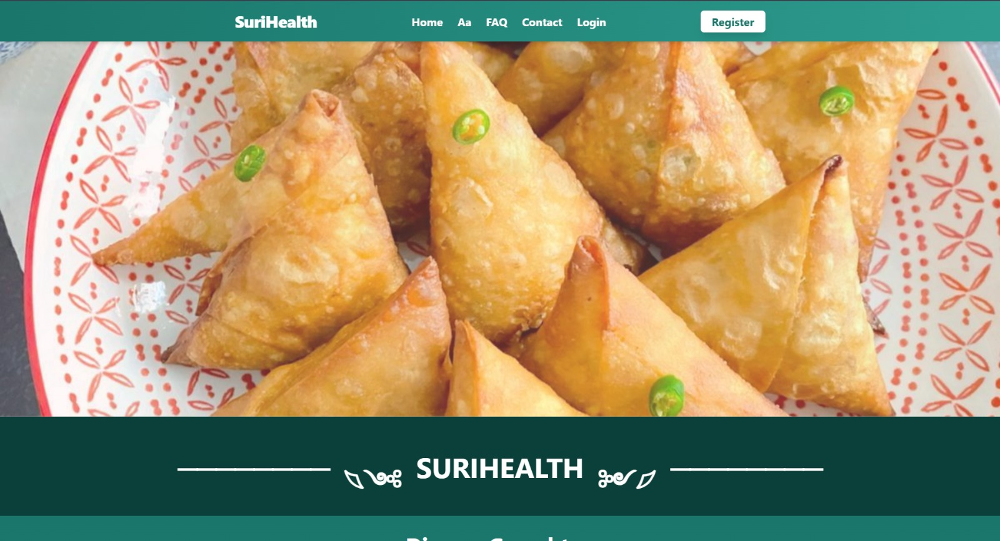

Het SuriHealth maaltijdplatform is ontworpen als een webapplicatie en is direct toegankelijk via elke ondersteunde webbrowser. Afhankelijk van de test- of productieomgeving kan het platform lokaal of via een extern webadres worden benaderd.

---

## Stappen om de Applicatie te Openen

Volg de onderstaande stappen om verbinding te maken met het platform en de landingspagina te initialiseren:

### 1. Open uw Webbrowser
Start een van de ondersteunde internetbrowsers op uw apparaat (bijvoorbeeld Google Chrome, Apple Safari of Microsoft Edge).

### 2. Navigeer naar het Platform
Voer de toepasselijke URL-koppeling in de adresbalk van uw browser in:
- **Lokale testomgeving (Development)**: Typ `http://localhost:3000` in en druk op enter. Dit is het standaardadres waarop de Nitro-server van het TanStack Start framework lokaal luistert.
- **Productie-omgeving (Live)**: Gebruik het specifieke webadres dat door uw beheerder of hostingprovider is verstrekt.

### 3. De Landingspagina Laden
Zodra de verbinding tot stand is gebracht, laadt de browser de homepage van SuriHealth. Vanaf dit centrale startpunt kan de gebruiker zich registreren, inloggen of direct navigeren naar de documentatiegidsen.

:::note
Mocht de pagina in een lokale testomgeving niet laden, controleer dan in uw PowerShell-terminal of de Node.js server succesvol is opgestart en er geen database-fouten (zoals een onbereikbare PostgreSQL-poort) actief zijn.
:::

---

## Interface Overzicht van de Homepage

De homepage biedt een overzichtelijke introductie van het platform. Hier vindt u gedetailleerde informatie over traditionele Surinaamse ingrediënten en de werking van de automatische dieetplanners.

*Figuur 1. Landingspagina van het SuriHealth platform.*

---

## Navigatiemogelijkheden

Rechtsboven in de hoofdnavigatiebalk van de website vindt u de belangrijkste knoppen om uw sessie te starten:

- **Inloggen**: Voor bestaande gebruikers om direct toegang te krijgen tot hun medische dashboard.
- **Registreren**: Voor nieuwe gebruikers om een account aan te maken en de biometrische intake te starten.
- **Font-resize**: Een interactieve knop om de font size te vergroten of verkleinen.

:::tip
Als u de applicatie voor de allereerste keer gebruikt, raden we aan om direct door te gaan naar de handleiding [Account Registreren](/guides/registreren/) om uw persoonlijke profiel op te zetten.
:::